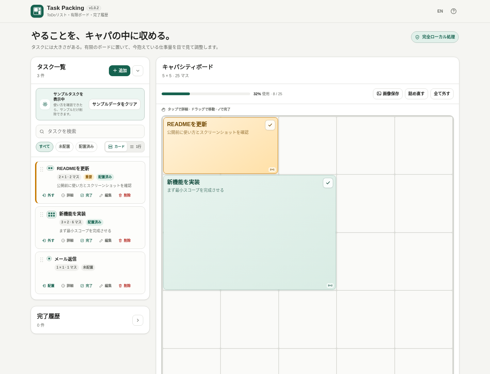

# Task Packing

[](https://github.com/ttomohisa/htmlapps-task-packing/actions/workflows/deploy-pages.yml)
[](LICENSE)
[](https://ttomohisa.github.io/htmlapps-task-packing/)
[](#プライバシーと実行時ネットワーク制限)

[English README](README.md)

**タスクに「大きさ」を持たせ、有限のキャパシティボードに収まる分だけ配置する**ローカルファーストのビジュアルToDoアプリです。

無限に増やせるToDoリストとは別に、Task Packingでは **「タスク一覧」と「有限ボード」** を分離しています。やること自体は一覧に保持したまま、自分が今抱えられる仕事だけをボードへ配置します。

## 🚀 Live demo

### [Task PackingをGitHub Pagesで開く](https://ttomohisa.github.io/htmlapps-task-packing/)

GitHub Pagesが配信するのは最初のHTMLだけです。タスク、ボード配置、完了履歴、JSONバックアップの生成・復元はブラウザー内で処理され、アプリがタスク内容をサーバーへアップロードすることはありません。

[](https://ttomohisa.github.io/htmlapps-task-packing/)

## Features

- **普通のToDoリストとしてタスクを保持** — ボードへ配置済みでも未配置でも、アクティブなタスクは一覧に残ります。
- **仕事量を面積で表現** — XS / S / M / L / XL、または「その他」から1×1〜8×8の任意サイズを指定できます。
- **有限のキャパシティで考える** — 初期値は5×5。4×4 / 7×7 / 9×9プリセットや、縦横3〜16マスの任意サイズにも変更できます。
- **無理な配置を防止** — タスク同士の重なりやボード外へのはみ出しを禁止します。空きマス数に加えて「最大の空き長方形」も確認できます。
- **ドラッグで直接整理** — PCではボード内移動、タスク一覧の並べ替え、ボード→一覧への取り外し、タスク一覧⇄完了履歴の移動ができます。
- **スマホでも配置しやすい** — 「配置」を押してから置きたいマスをタップする方式を用意しています。
- **重要タスクを強調** — 「重要」を付けると、ボード上で暖色のブロックとして表示します。
- **ボードからそのまま完了** — 配置済みタスクには完了ボタンがあり、誤操作はトーストからすぐに元へ戻せます。
- **完了履歴を別管理** — タスクへ戻す、個別削除、確認付きの「すべて削除」に対応しています。
- **ボード上でメモを確認** — 十分な大きさのブロックではメモ本文を表示し、詳細表示もできます。
- **詰め直し** — 配置済みタスクを再配置して、まとまった空きスペースを作れます。
- **常に手前のミニボード** — 対応ChromiumブラウザーではDocument Picture-in-Pictureを使い、小さな別ウィンドウから完了・直前完了のUndoができます。
- **ローカル完結** — localStorageへの自動保存、明示的なJSONバックアップ、CSPによる実行時ネットワーク遮断に対応しています。
- **日本語 / English** — 再読み込みなしで切り替えられます。

## Quick start

### Web版を使う

[GitHub Pages版](https://ttomohisa.github.io/htmlapps-task-packing/)を開くだけです。インストールやアカウント登録はありません。

### 単一HTMLを使う

1. このリポジトリまたはRelease成果物から `dist/index.html` をダウンロードします。
2. 現行のデスクトップ / モバイルブラウザーで開きます。
3. タスクを追加してボードへの配置を始めます。

コア機能にローカルWebサーバーは不要です。オプションの**ミニボード**はDocument Picture-in-Picture対応状況に依存するため、GitHub PagesのようなHTTPS配信での利用を推奨します。

## Usage

1. タスク一覧の「追加」からタスクを登録します。
2. 大きさを選びます。XS〜XLで素早く指定でき、「その他」を選んだときだけ横マス・縦マスの入力欄が表示されます。
3. 必要なら「重要」を付け、メモを入力します。
4. まだ抱えないタスクは未配置のまま保持し、取り組むものだけ「配置」からボードへ置きます。
5. PCでは配置済みタスクをドラッグして移動できます。ボードからタスク一覧へドラッグすると未配置に戻せます。
6. タスク一覧またはボードの完了ボタンからタスクを完了します。間違えた場合はトーストの「元に戻す」を使えます。
7. 完了したタスクは「完了履歴」で確認します。タスクへ戻す、個別削除、「すべて削除」ができます。
8. 自分の計画範囲に合わせてボードサイズを変更します。縮小して収まらなくなったタスクも削除されず、未配置として一覧へ戻ります。
9. データを持ち出したいときは「ボードとデータ」からJSONバックアップを保存します。

### タスクサイズは「時間」ではなく「キャパ」

Task Packingでは、1マスを15分などの固定時間にはしません。短くても精神的に重い仕事は大きく、長くても機械的な作業は小さくして構いません。カレンダーではなく、**自分が同時に抱える仕事量**を表すためのボードです。

### ボードの指標

「空きマス」と「最大の空き長方形」を別々に表示します。空きが10マスあっても細切れなら3×2のタスクは置けません。「詰め直す」を使うと配置済みタスクを寄せて、より大きな連続スペースを作れます。

### 完了履歴

完了履歴はアクティブなタスク一覧とは独立しています。タスクを完了すると一覧から外れ、完了時刻とともに履歴へ移ります。

- 完了直後はトーストからUndoできます。
- PCでは履歴からタスク一覧へドラッグして戻せます。
- 「タスクへ戻す」で未配置タスクとして復元できます。
- 履歴を1件ずつ削除でき、個別削除はUndoできます。
- 「すべて削除」は確認後に完了履歴全体を削除します。

### ミニボード

**ミニボード**はDocument Picture-in-Picture APIを利用します。対応ブラウザーではキャパシティボードを小さな常時手前ウィンドウで表示し、メインタブを開いたままにしなくてもタスクを確認・完了できます。ミニボードから直前に完了したタスクは、そのウィンドウ内の「元に戻す」から復元できます。

Document Picture-in-Picture非対応ブラウザーではミニボードだけが使えません。通常のボードやその他の機能には影響しません。

## JSONバックアップ形式

バックアップのスキーマバージョンは `1` です。ボードサイズ、タスク一覧の順序、大きさ、重要フラグ、有効な配置、メモ、完了履歴を保存します。

```json
{
  "app": "task-packing",
  "schemaVersion": 1,
  "exportedAt": "2026-08-25T00:00:00.000Z",
  "state": {
    "version": 1,
    "board": { "rows": 5, "cols": 5 },
    "tasks": [],
    "history": []
  }
}
```

## GitHub Pagesで公開する

単一HTMLの検証とGitHub Pagesへの公開用Workflowを同梱しています。

1. `htmlapps-task-packing` としてGitHubへpushします。
2. **Settings → Pages → Build and deployment → Source** で **GitHub Actions** を選びます。
3. `main` にpushするか、Actionsから **Deploy standalone app to GitHub Pages** を手動実行します。
4. 成功すると `https://ttomohisa.github.io/htmlapps-task-packing/` で公開されます。

公開前にスタンドアロンHTMLを再ビルドし、リポジトリ検証を通してから `dist/` をデプロイします。

## Development and build layout

```text
.
├─ src/index.template.html       # アプリ本体のテンプレート
├─ app.config.json               # アプリ情報・ビルド設定
├─ dependencies.json             # 実行時依存関係（現在は空）
├─ build-standalone.bat          # Windows用ビルド入口
├─ build-standalone.ps1          # 単一HTMLビルダー
├─ scripts/                      # 検証・self-extract生成スクリプト
├─ assets/
│  ├─ favicon.svg
│  ├─ screenshot.png             # 日本語UI
│  └─ screenshot-en.png          # 英語UI
├─ dist/
│  ├─ index.html                 # 読みやすい単一HTML版
│  └─ index.self-extract.html    # self-extract版
└─ .github/workflows/
   ├─ build-standalone.yml       # Pull Request検証
   └─ deploy-pages.yml           # GitHub Pages公開
```

### Windowsでビルド

```bat
build-standalone.bat
```

`dist/` に通常版とself-extract版を生成し、ビルド用プレースホルダーや実行時ネットワーク制限などを検証します。

## プライバシーと実行時ネットワーク制限

Task Packingは個人のタスクデータをローカルで扱う設計です。

- アカウント、アクセス解析、テレメトリ、クラウド同期、サーバー側タスク保存はありません。
- タスクと完了履歴は、明示的にJSONを書き出さない限りブラウザーのメモリ / localStorage内に留まります。
- JSON復元ではユーザーが選択したファイルだけを読み取ります。
- 生成HTMLには `connect-src 'none'` を含むContent Security Policyがあります。
- 現在、実行時のサードパーティ依存ライブラリはありません。

GitHub Pages版は最初のHTML取得だけネットワーク通信が必要です。読み込み後、Task Packingのコア機能が外部APIへ接続することはありません。

## Browser support / Limitations

- タスク、ボード、履歴、バックアップ、言語切替は現行のChromium / Firefox / Safariを対象にしています。
- PC向けドラッグ&ドロップはポインタ操作を前提とします。スマホでは「配置 → マスをタップ」を利用してください。
- Document Picture-in-Pictureは全ブラウザー対応ではないため、ミニボードは拡張機能扱いです。
- ブラウザーのサイトデータを削除するとlocalStorageも消える場合があります。残したいデータはJSONバックアップしてください。
- 大量のタスクもブラウザー内だけで処理します。このアプリはチーム向けプロジェクトDBではなく、個人のキャパシティ調整を目的としています。
- 1マスは固定時間を表しません。時間割やカレンダーの代替ではありません。

## Dependencies

Task Packingには現在、**サードパーティの実行時依存関係はありません**。UI、ボード配置、ドラッグ&ドロップ、永続化、バックアップ、履歴は単一HTMLのソース内で実装しています。

リポジトリの通知事項は [THIRD_PARTY_NOTICES.md](THIRD_PARTY_NOTICES.md) を参照してください。

## Contributing

不具合報告や機能提案はGitHub Issuesから歓迎します。開発時の案内は [CONTRIBUTING.md](CONTRIBUTING.md) を参照してください。

## License

Copyright © 2026 ttomohisa

[MIT License](LICENSE) で公開します。
