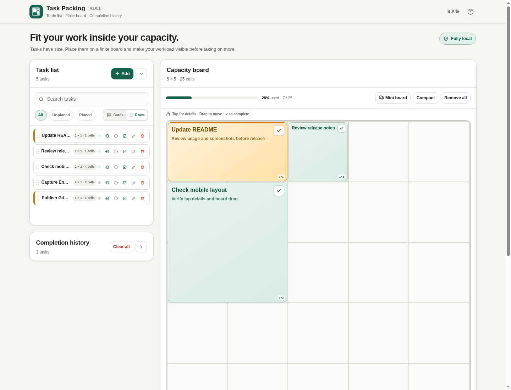

# Task Packing

[](https://github.com/ttomohisa/htmlapps-task-packing/actions/workflows/deploy-pages.yml)
[](LICENSE)
[](https://ttomohisa.github.io/htmlapps-task-packing/)
[](#privacy-and-runtime-network-protection)

[日本語版 README](README.ja.md)

A local-first visual ToDo app that gives every task a physical size and asks you to fit your work onto a finite-capacity board.

Instead of letting an endless backlog make everything look equally possible, Task Packing separates the **task list** from the **capacity board**. Keep tasks in the list, decide how large they feel, and place only what actually fits.

## 🚀 Live demo

### [Open Task Packing on GitHub Pages](https://ttomohisa.github.io/htmlapps-task-packing/)

GitHub Pages only serves the initial HTML. Task data, board placement, completion history, backup generation, and restore are processed locally in your browser. The app does not upload your tasks to a server.

[](https://ttomohisa.github.io/htmlapps-task-packing/)

## Features

- **Keep a normal task list** — Tasks remain in the list whether they are placed on the board or not. Switch between information-rich cards and compact one-line rows; your preferred view is remembered locally.
- **Make workload visible as area** — Choose XS/S/M/L/XL or define a custom width and height from 1×1 to 8×8.
- **Work inside finite capacity** — Start with a 5×5 board, switch to 4×4 / 7×7 / 9×9, or set custom rows and columns from 3 to 16.
- **Prevent impossible plans** — Tasks cannot overlap or extend outside the board. Free cells and the largest contiguous free rectangle are shown separately.
- **Rearrange directly** — Drag tasks within the board, reorder the task list, move a board task back to the list, or drag between active tasks and completion history on desktop.
- **Place multiple tasks on mobile** — Select several unplaced tasks and add them together only after the app verifies that the whole selection can fit.
- **Highlight important work** — Mark a task as Important to give it a distinct warm color on the board.
- **Complete from the board** — Every placed task has a visible completion control. Completion can be undone immediately from the toast.
- **Keep completion history separate** — Restore completed tasks, delete individual history entries, or clear the full history after confirmation. On desktop the history panel starts collapsed, and the task list can also be collapsed when you want more visual focus.
- **Open details explicitly** — Use the **Details** action in the task list or completion history, or tap/click a board task. Tiny 1×1 blocks still open the same readable detail view, including elapsed days since the task was added.
- **Compact the board** — Repack placed tasks deterministically to recover larger contiguous free space.
- **Open an always-on-top Mini board** — On supported Chromium browsers, Document Picture-in-Picture provides a compact board with completion and latest-completion Undo.
- **Stay local** — Data is stored in browser localStorage, JSON backup/restore is explicit, and runtime network access is blocked by CSP.
- **Use Japanese or English** — Switch the interface language without reloading.

## Quick start

### Use the web demo

Open the [GitHub Pages demo](https://ttomohisa.github.io/htmlapps-task-packing/). No account or installation is required.

### Use the standalone HTML

1. Download `dist/index.html` from this repository or from a release artifact.
2. Open it in a current desktop or mobile browser.
3. Add tasks and start placing them on the board.

The core app does not require a local web server. The optional **Mini board** depends on the browser's Document Picture-in-Picture support and is best used from an HTTPS-hosted copy such as GitHub Pages.

## Usage

1. Add a task from the task list. Use the card/row toggle beside the filters when you want either richer context or a denser one-line overview.
2. Choose its size. Use XS–XL for quick sizing, or choose **Other** to reveal custom width/height fields.
3. Optionally mark the task as **Important** and add a note.
4. On desktop, drag an unplaced task onto the board. The **Place** action can also auto-place a single task into the first suitable free area.
5. On mobile, use **Place multiple** to select several unplaced tasks. The app simulates the whole selection first and commits only when every selected task can be placed.
6. Moving a board task is drag-only. Tap or click a task block to open its details. In the task list, use the explicit **Details** action instead of clicking the whole card. On desktop, drag a placed task back to the task list to unplace it.
7. Complete a task from the task list or directly from its board block. Use the toast to Undo accidental completion.
8. Review completed work in **Completion history**. On desktop, this panel starts collapsed. Restore entries to the task list, delete one entry, or use **Clear all** when you no longer need the history.
9. Resize the board whenever your planning horizon changes. Tasks that no longer fit are preserved and returned to the unplaced list.
10. Save a JSON backup from **Board & data** when you want a portable copy of your local state.

### Task list views

Task Packing v1.0.1 provides two views for the same active task list:

- **Cards** show the mini size grid, note preview, status badges, and labeled actions. Use this when you want more context while planning.
- **Rows** keep each task to one compact line and use icon actions for higher information density. Use this when you have many tasks to scan or reorder quickly.

Both views use the same task order and support drag reordering. Switching views does not change task data or JSON backup schema; the selected view is stored only as a local UI preference.

### Task size is capacity, not time

Task Packing intentionally does not define one cell as a fixed number of minutes. A small but mentally heavy task can be large; a long but routine task can be small. The board represents the amount of capacity you are willing to commit, not a calendar schedule.

### Board metrics

The board reports both **free cells** and the **largest free rectangle**. This matters because ten scattered empty cells may still be unable to fit a 3×2 task. Use **Compact** when you want to repack placed tasks and create larger contiguous space.

### Completion history

Completion history is independent from the active task list. Completing a task removes it from active work and records its completion time. You can:

- Undo immediately from the completion toast.
- Drag a history entry back to the task list on desktop.
- Use **Details** to review its size, Important state, completion time, and note.
- Use **Restore to tasks** to bring it back as an unplaced task.
- Delete one history entry with Undo.
- Use **Clear all** to permanently delete all completion history after confirmation.

### Mini board

**Mini board** uses the Document Picture-in-Picture API. When supported, it opens the capacity board in a small always-on-top window and lets you complete tasks without keeping the main tab visible. The Mini board also includes an Undo action for the latest task completed from that window.

This is an optional enhancement. Browsers without Document Picture-in-Picture continue to support the normal board without losing functionality.

## JSON backup format

Backups use schema version `1` and contain the board dimensions, active task order, task sizes, Important flags, valid placements, notes, and completion history.

```json
{
  "app": "task-packing",
  "schemaVersion": 1,
  "exportedAt": "2026-08-25T00:00:00.000Z",
  "state": {
    "version": 1,
    "board": { "rows": 5, "cols": 5 },
    "tasks": [],
    "history": []
  }
}
```

## Publish with GitHub Pages

The repository includes workflows for standalone validation and GitHub Pages deployment.

1. Push the repository to GitHub as `htmlapps-task-packing`.
2. Open **Settings → Pages → Build and deployment → Source** and select **GitHub Actions**.
3. Push to `main`, or manually run **Deploy standalone app to GitHub Pages** from the Actions tab.
4. After a successful deployment, the demo is available at `https://ttomohisa.github.io/htmlapps-task-packing/`.

Each deployment rebuilds the standalone HTML and runs repository verification before publishing `dist/`.

## Development and build layout

```text
.
├─ src/index.template.html       # Application source template
├─ app.config.json               # App metadata and build options
├─ dependencies.json             # Runtime dependency manifest (currently empty)
├─ build-standalone.bat          # Windows build entry point
├─ build-standalone.ps1          # Standalone HTML builder
├─ scripts/                      # Verification and self-extract build scripts
├─ assets/
│  ├─ favicon.svg
│  ├─ screenshot.png             # Japanese UI
│  └─ screenshot-en.png          # English UI
├─ dist/
│  ├─ index.html                 # Readable standalone build
│  └─ index.self-extract.html    # Self-extracting standalone build
└─ .github/workflows/
   ├─ build-standalone.yml       # Pull request validation
   └─ deploy-pages.yml           # GitHub Pages deployment
```

### Build locally on Windows

```bat
build-standalone.bat
```

The build generates the readable and self-extracting standalone HTML files in `dist/` and verifies that required placeholders are resolved and runtime network restrictions are preserved.

## Privacy and runtime network protection

Task Packing is designed for local task data.

- No account, analytics, telemetry, cloud sync, or server-side task storage.
- Task data and completion history stay in browser memory/localStorage unless you explicitly export a JSON backup.
- JSON restore reads only the file you choose.
- The generated HTML includes a Content Security Policy with `connect-src 'none'`.
- There are currently no third-party runtime dependencies.

GitHub Pages naturally requires the initial HTML request. After the app has loaded, Task Packing itself does not need runtime API access for its core features.

## Browser support and limitations

- Core task, board, history, backup, and language features target current Chromium, Firefox, and Safari releases.
- Board tasks support both mouse and touch: click/tap opens details, while dragging moves the block. Touch movement uses Pointer Events with a Touch Events fallback; multi-task placement is handled through the dedicated mobile selection flow.
- Document Picture-in-Picture is not available in every browser; Mini board is therefore an optional enhancement.
- localStorage can be removed when browser/site data is cleared. Export JSON backups for data you need to keep.
- Very large task lists remain local to the browser; this app is intentionally a personal planning tool rather than a team/project database.
- Board cells represent subjective capacity, not a fixed duration or calendar slot.

## Dependencies

Task Packing currently has **no third-party runtime dependencies**. The UI, board packing logic, drag-and-drop behavior, persistence, backup, and history are implemented directly in the standalone HTML source.

See [THIRD_PARTY_NOTICES.md](THIRD_PARTY_NOTICES.md) for repository notices.

## Contributing

Bug reports and feature proposals are welcome through GitHub Issues. See [CONTRIBUTING.md](CONTRIBUTING.md) for development guidance.

## License

Copyright © 2026 ttomohisa

Licensed under the [MIT License](LICENSE).
